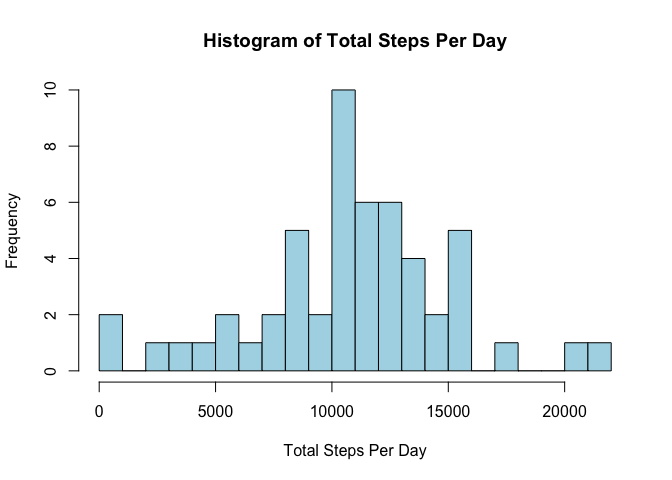
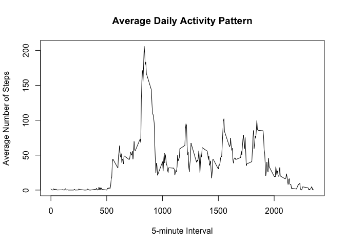
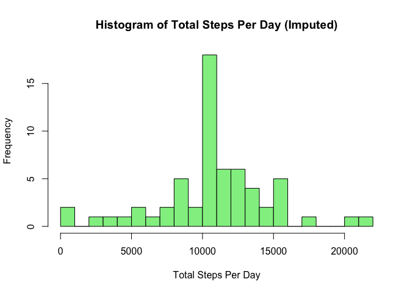
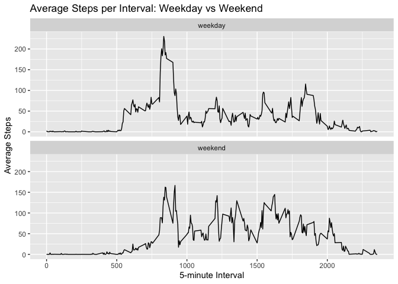

## Loading and preprocessing the data

``` r
data <- read.csv("activity.csv")
data$date <- as.Date(data$date)
head(data)
```

```
##   steps       date interval
## 1    NA 2012-10-01        0
## 2    NA 2012-10-01        5
## 3    NA 2012-10-01       10
## 4    NA 2012-10-01       15
## 5    NA 2012-10-01       20
## 6    NA 2012-10-01       25
```

## What is mean total number of steps taken per day?

``` r
total_steps_day <- aggregate(steps ~ date, data, sum, na.rm = TRUE)

hist(total_steps_day$steps,
     main = "Histogram of Total Steps Per Day",
     xlab = "Total Steps Per Day",
     col = "lightblue",
     breaks = 20)
```

<!-- -->

``` r
mean_steps <- mean(total_steps_day$steps)
median_steps <- median(total_steps_day$steps)

mean_steps
```

```
## [1] 10766.19
```

``` r
median_steps
```

```
## [1] 10765
```

## What is the average daily activity pattern?

``` r
average_interval <- aggregate(steps ~ interval, data, mean, na.rm = TRUE)

plot(average_interval$interval,
     average_interval$steps,
     type = "l",
     xlab = "5-minute Interval",
     ylab = "Average Number of Steps",
     main = "Average Daily Activity Pattern")
```

<!-- -->

``` r
max_interval <- average_interval[which.max(average_interval$steps), ]
max_interval
```

```
##     interval    steps
## 104      835 206.1698
```

## Imputing missing values

``` r
sum(is.na(data$steps))
```

```
## [1] 2304
```

``` r
interval_means <- aggregate(steps ~ interval, data, mean, na.rm = TRUE)

data_filled <- data

for (i in 1:nrow(data_filled)) {
  if (is.na(data_filled$steps[i])) {
    data_filled$steps[i] <- interval_means$steps[
      interval_means$interval == data_filled$interval[i]
    ]
  }
}
```

## Histogram After Imputation

``` r
total_steps_day_filled <- aggregate(steps ~ date, data_filled, sum)

hist(total_steps_day_filled$steps,
     main = "Histogram of Total Steps Per Day (Imputed)",
     xlab = "Total Steps Per Day",
     col = "lightgreen",
     breaks = 20)
```

<!-- -->

``` r
mean(total_steps_day_filled$steps)
```

```
## [1] 10766.19
```

``` r
median(total_steps_day_filled$steps)
```

```
## [1] 10766.19
```

## Are there differences in activity patterns between weekdays and weekends?

``` r
data_filled$day_type <- ifelse(
  weekdays(data_filled$date) %in% c("Saturday", "Sunday"),
  "weekend",
  "weekday"
)

data_filled$day_type <- as.factor(data_filled$day_type)

interval_daytype <- aggregate(steps ~ interval + day_type,
                              data_filled,
                              mean)

library(ggplot2)

ggplot(interval_daytype,
       aes(x = interval, y = steps)) +
  geom_line() +
  facet_wrap(~ day_type, ncol = 1) +
  labs(title = "Average Steps per Interval: Weekday vs Weekend",
       x = "5-minute Interval",
       y = "Average Steps")
```

<!-- -->
